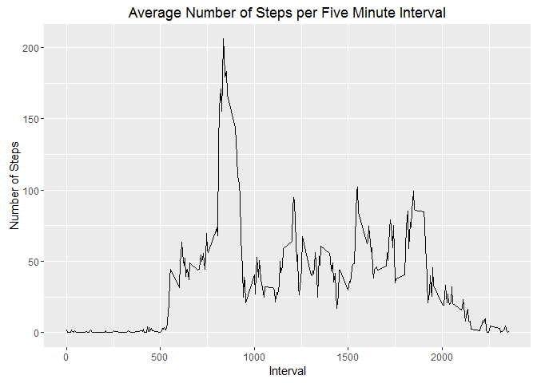
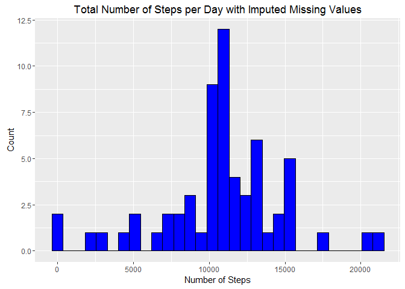

# Reproducible Research: Peer Assessment 1


## Loading and preprocessing the data

```r
library(dplyr)
```

```
## 
## Attaching package: 'dplyr'
## 
## The following object is masked from 'package:stats':
## 
##     filter
## 
## The following objects are masked from 'package:base':
## 
##     intersect, setdiff, setequal, union
```

```r
library(lubridate)
library(ggplot2)
options(scipen=999)

unzip("activity.zip")
data <- read.csv("activity.csv") %>%
    mutate(date = ymd(date))
```

## Data analysis

### What are the mean total number of steps taken per day?

1. Calculate the total number of steps per day are using summarize from dplyr. Missing values will be ignored. 
2. Create a histogram plot of the total number of steps per day using ggplot2. 
3. Calculate the mean and median number of steps per day.


```r
totals <- group_by(data, date) %>%
    summarize(total.steps = sum(steps, na.rm=TRUE))
graph <- ggplot(totals, aes(x=total.steps)) +
    geom_histogram(colour="black", fill="blue") +
    ggtitle("Total Number of Steps per Day") +
    xlab("Number of Steps") + 
    ylab("Count")
print(graph) 
```

 

```r
step.mean <- mean(totals$total.steps)
step.median <- median(totals$total.steps)
```

The mean total number of steps per day is 9354.2295082.  

The median total number of steps per day is 10395.

### What is the average daily activity pattern?

1. Average the number of steps taken in each 5-minute interval across all days using summarize from dplyr. Missing values will be ignored. Create a time-series plot (line plot) of the 5-minute interval (x-axis) and the average number of steps taken (y-axis), using ggplot2.
2. Determine which 5-minute interval, on average across all the days in the dataset, contains the maximum number of steps.


```r
activity <- group_by(data, interval) %>%
    summarize(mean.steps = mean(steps, na.rm=TRUE))
graph <- ggplot(activity, aes(x=interval, y=mean.steps)) +
    geom_line() +
    ggtitle("Average Number of Steps per Five Minute Interval") +
    xlab("Interval") + 
    ylab("Number of Steps")
print(graph) 
```

 

```r
max.steps <- arrange(activity, desc(mean.steps)) %>%
    ungroup %>%
    summarize(interval = first(interval))
```

The maximum number of steps occurred in the 835-minute interval.

### Imputing missing values

1. Calculate and report the total number of missing values in the dataset.
2. Fill in missing data using the mean number of steps across all days for that 5-minute interval, rounded to nearest whole number, and store the new dataset in data.filled.
3. Create a histogram plot of the total number of steps per day using the new dataset.  Calculate the mean and median total number of steps taken per day and compare these to the earlier estimated mean and median total number of steps. 


```r
missing <- filter(data, is.na(steps))
num.miss <- nrow(missing)

data.filled <- left_join(data, activity, by="interval") %>%
    mutate(steps = ifelse(is.na(steps), round(mean.steps,0), steps)) %>%
    select(-mean.steps)

totals.filled <- group_by(data.filled, date) %>%
    summarize(total.steps = sum(steps))

graph <- ggplot(totals.filled, aes(x=total.steps)) +
    geom_histogram(colour="black", fill="blue") +
    ggtitle("Total Number of Steps per Day with Imputed Missing Values") +
    xlab("Number of Steps") + 
    ylab("Count")
print(graph) 
```

 

```r
filled.mean <- mean(totals.filled$total.steps)
filled.median <- median(totals.filled$total.steps)
diff.mean <- (filled.mean / step.mean - 1) * 100
diff.median <- (filled.median / step.median - 1) * 100
```

The number of missing values is 2304.

With imputed missing values, the mean total number of steps per day is 10765.6393443. This is a difference of 15.1% from the original estimated mean total number of steps per day.

With imputed missing values, the median total number of steps per day is 10762. This is a difference of 3.5% from the original estimated median total number of steps per day.


### Are there differences in activity patterns between weekdays and weekends?

1. Using the new dataset, create a new factor variable indicating whether a given date is a weekday or weekend day.
2. Create a panel time-series plot (line plot) of the 5-minute interval (x-axis) and the average number of steps taken (y-axis), averaged across all weekday days or weekend days. 


```r
data.filled <- mutate(data.filled, day.week = factor(ifelse(weekdays(date) == "Saturday" | weekdays(date) == "Sunday", "weekend", "weekday")))

activity.filled <- group_by(data.filled, day.week, interval) %>%
    summarize(mean.steps = mean(steps))

graph <- ggplot(activity.filled, aes(x=interval, y=mean.steps)) +
    geom_line() +
    facet_grid(day.week ~ .) +
    ggtitle("Average Number of Steps per Five Minute Interval") +
    xlab("Interval") + 
    ylab("Number of Steps")
print(graph) 
```

 

